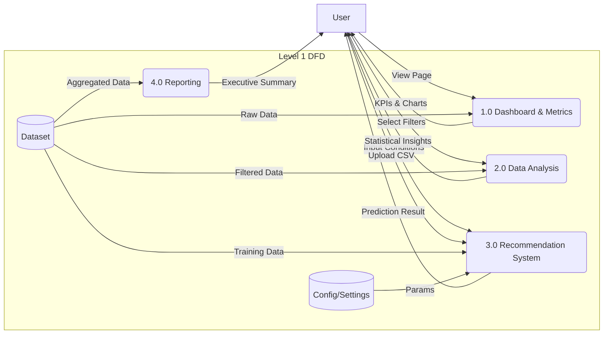

```mermaid
graph LR
    User[User]
    
    subgraph "Level 1 DFD"
        P1(1.0 Dashboard & Metrics)
        P2(2.0 Data Analysis)
        P3(3.0 Recommendation System)
        P4(4.0 Reporting)
        
        DS1[(Dataset)]
        DS2[(Config/Settings)]
    end
    
    %% Inputs
    User -->|View Page| P1
    User -->|Select Filters| P2
    User -->|Input Conditions| P3
    User -->|Upload CSV| P3
    
    %% Data Access
    DS1 -->|Raw Data| P1
    DS1 -->|Filtered Data| P2
    DS1 -->|Training Data| P3
    DS2 -->|Params| P3
    DS1 -->|Aggregated Data| P4
    
    %% Outputs
    P1 -->|KPIs & Charts| User
    P2 -->|Statistical Insights| User
    P3 -->|Prediction Result| User
    P4 -->|Executive Summary| User
```
